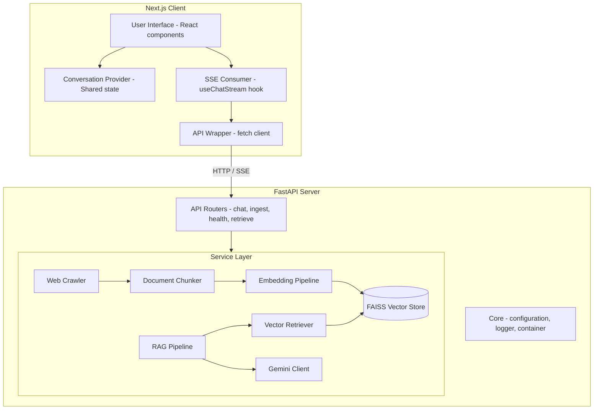
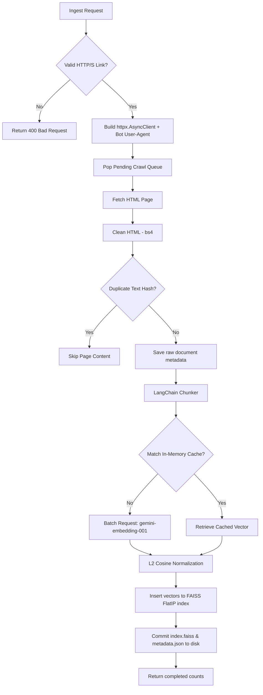
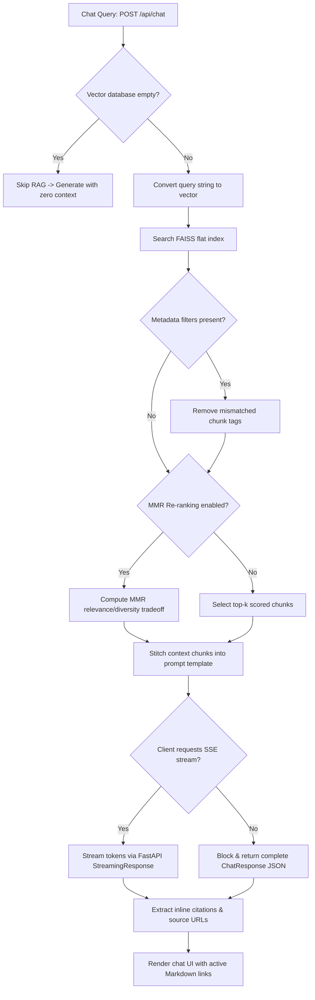
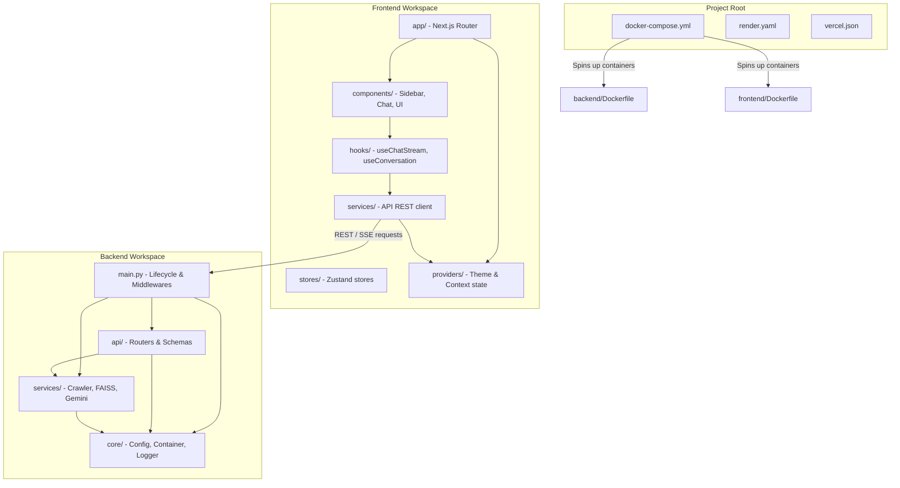

# System Architecture Manual

This document outlines the system architecture, component layout, and data pipeline flows of the Website RAG Assistant. It serves as a technical onboarding reference for new developers joining the project.

---

## Component Layout

The system is divided into two distinct services: a **FastAPI backend** handling indexing, retrieval, and generation; and a **Next.js frontend** serving the conversational and management interfaces.



---

## 1. System Components

### Frontend Components
- **`ConversationProvider`**: Shared React context tracking conversation metadata (IDs, titles, active messages). It synchronizes modifications automatically with `localStorage` and exposes state hooks to subcomponents.
- **`Sidebar`**: Left-side layout panel displaying the conversation list, search utility, creation controls, and a redirect trigger pointing to `/indexing`.
- **`ChatWindow`**: Conversational frame consuming real-time Server-Sent Events (SSE). Renders markdown messages with responsive citations and floating auto-scroll controls.
- **`IndexWebsiteClient`**: Page view validating domain inputs, invoking crawling processes, and outputting execution milestones.

### Backend Components
- **Lifespan Manager**: Context manager controlling FastAPI hooks. Validates Google Gen AI model parameters on startup and runs index synchronization tasks to disk during shutdown.
- **Async Crawler**: Scraping engine fetching HTML content using `httpx` and `BeautifulSoup4`. Isolates domains and overrides default HTTP user-agent headers.
- **Document Chunker**: Splitter partitioning documents by paragraphs and sentence tokens. Calculates deterministic ID values using a SHA-256 scheme.
- **Embedding Pipeline**: Engine processing content vectors via `gemini-embedding-001`. Implements thread pools, batch processing, and internal RAM caching.
- **FAISS Vector Store**: Flat index (`IndexFlatIP`) matching query targets using cosine distance logic. Updates persistent metadata sidecars (`metadata.json`).
- **Retrieval Engine**: Multi-mode retrieval service performing similarity matching, metadata checks, and Max Marginal Relevance (MMR) filtering.
- **RAG Coordinator**: Engine stitching retrieval contexts into structured prompts, initiating generative calls to `gemini-3.5-flash`, and parsing citation URLs from outputs.

---

## 2. Sequence Diagram (Full Cycle)

The interaction pattern between the user, the frontend client, the FastAPI endpoints, local indexes, and the external Gemini APIs:

```mermaid
sequenceDiagram
    autofunc
    actor User
    participant FE as Next.js Client
    participant BE as FastAPI Backend
    participant DB as FAISS Vector Store
    participant Gemini as Google Gemini API

    %% Indexing Pipeline Sequence
    rect rgb(240, 240, 245)
        Note over User, Gemini: 1. Website Indexing Flow
        User->>FE: Submit URL (https://docs.python.org/3/)
        FE->>BE: POST /api/ingest {urls, max_depth}
        activate BE
        BE->>BE: Async crawl seed URL (httpx + BeautifulSoup)
        BE->>BE: Partition texts (RecursiveCharacterTextSplitter)
        BE->>Gemini: Request embeddings (gemini-embedding-001)
        Gemini-->>BE: Return vectors (768-dim)
        BE->>DB: Add vectors & metadata to FAISS flat index
        BE->>DB: Write index.faiss & metadata.json to disk
        BE-->>FE: Return completed status & counts
        deactivate BE
        FE-->>User: Render ingestion statistics
    end

    %% Chat Pipeline Sequence
    rect rgb(245, 240, 240)
        Note over User, Gemini: 2. Chat / RAG Retrieval & Generation Flow
        User->>FE: Ask: "What is Python?"
        FE->>BE: POST /api/chat {query, stream: true}
        activate BE
        BE->>Gemini: Generate query embedding (RETRIEVAL_QUERY)
        Gemini-->>BE: Return query vector
        BE->>DB: Search query vector in FAISS FlatIP index
        DB-->>BE: Return nearest chunks + metadata scores
        BE->>BE: Format prompt with context & grounding rules
        BE->>Gemini: Stream prompt (gemini-3.5-flash)
        activate Gemini
        loop Token Stream
            Gemini-->>BE: Stream token chunks
            BE-->>FE: SSE data chunk event
            FE-->>User: Append text in real-time
        end
        deactivate Gemini
        BE-->>FE: SSE done event (citations metadata)
        deactivate BE
        FE-->>User: Render formatted markdown & source links
    end
```

---

## 3. Website Indexing Pipeline

Processing details for ingested URLs:



---

## 4. Chat Request Pipeline

Processing flow for query generation:



---

## 5. Streaming Implementation

Streaming is implemented using FastAPI `StreamingResponse` on the backend and Server-Sent Events (SSE) on the frontend:

- **Thread-Safe Stream Capture**: The Google GenAI SDK methods are synchronous. To stream tokens dynamically without locking Uvicorn event loops, the backend launches `generate_content_stream` inside a Python executor thread.
- **Asynchronous Queue Pipeline**: Partial response chunks are captured in the background thread and written directly to an `asyncio.Queue`. The FastAPI route generator reads tokens from this queue and outputs standard SSE lines: `data: {"event": "token", "text": "..."}`.
- **Cancellation Monitoring**: The backend generator listens to request disconnect events. If a user interrupts the generation or closes the page, the backend task terminates the queue iteration and closes the generation worker thread.
- **Client Handler**: The frontend `useChatStream` hook uses the browser's `fetch` API. It reads the raw HTTP readable stream, translates chunks using `TextDecoder`, splits them by `data:` markers, and appends the tokens to the active message window in real-time.

---

## 6. Conversation State Management

Conversation state is managed in the frontend layout to ensure layout elements remain synchronized:

- **State Sync**: Conversation structures (ID, title, message lists, update timestamps) are stored in local storage and managed via React Context.
- **Centralized Event Processing**: Component modifications (creating new threads, selecting conversations, renaming, deleting) route through the provider hooks, modifying the state in one place to update all layout components simultaneously.
- **Routing Rules**: The sidebar and chat components are linked via Next.js routes. The sidebar acts as a global navigator; if a user performs actions (creating a chat or clicking a historical log) while on the `/indexing` view, the sidebar automatically redirects the viewport to `/chat`.

---

## 7. Folder Dependency Graph

Folder structural relationship and flow dependencies:



---

## 8. Deployment Architecture

Deployments are structured to handle frontend edge caching and persistent database requirements for local filesystems:

```
                  +--------------------------------+
                  |       Vercel Edge Network      |
                  |  - Next.js static asset build  |
                  |  - /api Rewrites to Backend    |
                  +--------------------------------+
                                  │
                          HTTPS API Request
                                  ▼
                  +--------------------------------+
                  |     Render Web Service         |
                  |  - Single-worker Docker ASGI   |
                  |  - FastAPI Application         |
                  +--------------------------------+
                                  │
                           Reads/Writes to
                                  ▼
                  +--------------------------------+
                  |      Render Persistent Volume   |
                  |  - Mounted at /app/vector_store|
                  |  - Stores index.faiss & JSON   |
                  +--------------------------------+
```

- **Vercel edge hosting**: The Next.js code is optimized for serverless deployments on Vercel. A rewrite rule inside `vercel.json` proxies API calls matching `/api/*` directly to the backend domain, avoiding CORS preflight checks.
- **Render persistent instances**: The backend container runs as a single-process service. It utilizes Render persistent volumes mapped to `/app/vector_store` to ensure the FAISS files survive container updates and service restarts.
- **Docker virtualization**: Local environments mirror the production deployment configuration using docker-compose networks to link the services together.
