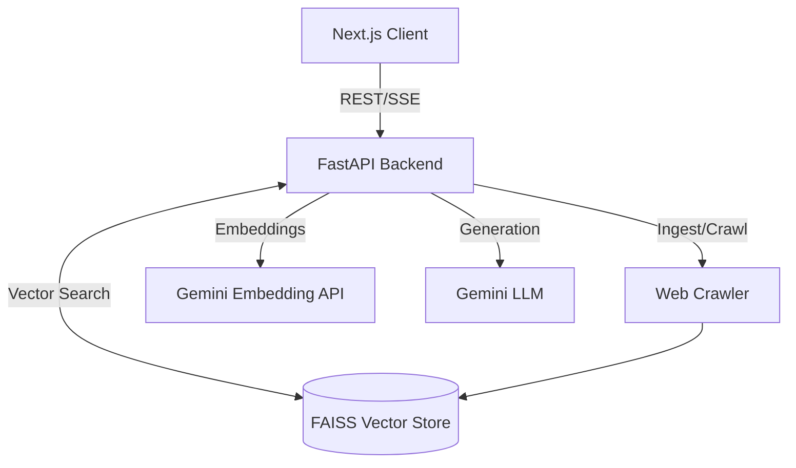

<div align="center">
  
  
  # Website RAG Assistant

  **A production-ready Retrieval-Augmented Generation (RAG) assistant for website content.**

  [](https://github.com/your-username/website-rag/actions/workflows/ci.yml)
  [](LICENSE)
  [](https://python.org)
  [](https://nextjs.org)

  [Features](#features) • [Architecture](#architecture) • [Quick Start](#quick-start) • [Deployment](#deployment) • [Roadmap](#future-roadmap)
</div>

---

## 📖 Project Overview

The **Website RAG Assistant** is a modern, modular, and production-ready application designed to crawl websites, index their content, and allow users to ask questions against that content using AI. 

It grounds its answers in the source material, providing precise citations for every claim. Built with **FastAPI**, **LangChain**, **Google Gemini**, and a beautiful **Next.js** frontend inspired by Perplexity and Claude.

## ✨ Features

- **Intelligent Ingestion:** Recursively crawls domains, extracts clean text, and chunks content intelligently while preserving semantic boundaries.
- **Precision RAG:** Uses Google Generative AI embeddings and a lightning-fast local FAISS vector store.
- **Citations & Grounding:** Responses include direct links to the source documentation used by the LLM.
- **Streaming UI:** Real-time Server-Sent Events (SSE) streaming with animated typing indicators and auto-scrolling.
- **Premium Design:** Glassmorphism, TailwindCSS styling, Framer Motion animations, and full dark/light mode support.
- **Production Secure:** Non-root Docker containers, strict CORS, rate-limiting ready, input validation via Pydantic, and secure headers.
- **Developer Experience:** CI/CD via GitHub Actions, strict TypeScript typing, JSON structured logging.

---

## 🏗️ Architecture



### Technology Stack
- **Frontend:** Next.js 14, React 18, TailwindCSS, shadcn/ui, Zustand, Framer Motion
- **Backend:** FastAPI, Python 3.12, Uvicorn, Pydantic
- **AI & RAG:** LangChain, Google Gemini API (`gemini-1.5-pro`), FAISS
- **Infrastructure:** Docker, Docker Compose, GitHub Actions, Vercel, Render

---

## 🚀 Quick Start (Local Development)

The easiest way to run the entire stack locally is using Docker Compose.

### 1. Prerequisites
- Docker and Docker Compose
- A Google Gemini API Key

### 2. Environment Configuration
Copy the example environment file and fill in your Gemini API key:
```bash
cp .env.example .env
# Edit .env and add your GEMINI_API_KEY
```

### 3. Run with Docker
```bash
docker-compose up --build
```
- **Frontend** will be available at: `http://localhost:3000`
- **Backend API** will be available at: `http://localhost:8000/api`
- **Swagger Docs** will be available at: `http://localhost:8000/docs`

---

## ☁️ Deployment

The project is pre-configured for modern PaaS deployments using Infrastructure-as-Code principles.

### Frontend (Vercel)
The frontend is optimized for Vercel's edge network.
1. Connect your GitHub repository to Vercel.
2. Vercel will automatically detect the Next.js framework.
3. Set the `NEXT_PUBLIC_API_URL` environment variable to your deployed backend URL (e.g., `https://my-rag-backend.onrender.com/api`).
4. (Optional) Alternatively, use the included `vercel.json` to handle proxying automatically if you prefer.

### Backend (Render)
The backend requires a persistent disk for the FAISS vector index. This is configured in `render.yaml`.
1. In the Render Dashboard, click **New > Blueprint**.
2. Connect your GitHub repository.
3. Render will parse the `render.yaml` and provision a Web Service with an attached 1GB Persistent Disk (`/data`).
4. Set the `GEMINI_API_KEY` securely in the Render dashboard.

### CI/CD
This repository includes two GitHub Actions workflows:
- **`ci.yml`**: Runs on every push/PR to `main`. Executes `flake8`, `mypy`, `npm run lint`, and tests.
- **`deploy.yml`**: Automates deployments to Vercel and Render using CLI tokens and Deploy Hooks.

---

## 📁 Folder Structure

```text
website-rag/
├── .github/workflows/       # CI/CD pipelines
├── backend/                 # FastAPI Application
│   ├── app/
│   │   ├── api/             # Routers (chat, ingest, retrieve)
│   │   ├── core/            # Config, Logger, Dependency Injection
│   │   └── services/        # LangChain, FAISS, Gemini logic
│   ├── Dockerfile           # Secure non-root container
│   └── requirements.txt
├── frontend/                # Next.js Application
│   ├── src/
│   │   ├── app/             # App Router pages and layout
│   │   ├── components/      # React components and shadcn/ui
│   │   ├── hooks/           # useChatStream, useConversation
│   │   └── services/        # API wrapper
│   └── Dockerfile           # Next.js standalone container
├── .env.example             # Environment template
├── docker-compose.yml       # Local orchestration
├── render.yaml              # Render IaC blueprint
└── vercel.json              # Vercel configuration
```

---

## 🗺️ Future Roadmap

The codebase is abstracted to easily support future enhancements:
- **Managed Vector Databases:** `BaseVectorStore` allows swapping FAISS for Pinecone, Qdrant, or Milvus simply by injecting a new class.
- **Hybrid Search:** Combine BM25 keyword search with vector similarity for better retrieval recall.
- **Authentication:** Add OAuth2 via Auth0 or Clerk.
- **PostgreSQL Metadata:** Move conversation history from local storage to a relational database.

---

## 📄 License

This project is licensed under the MIT License - see the LICENSE file for details.
